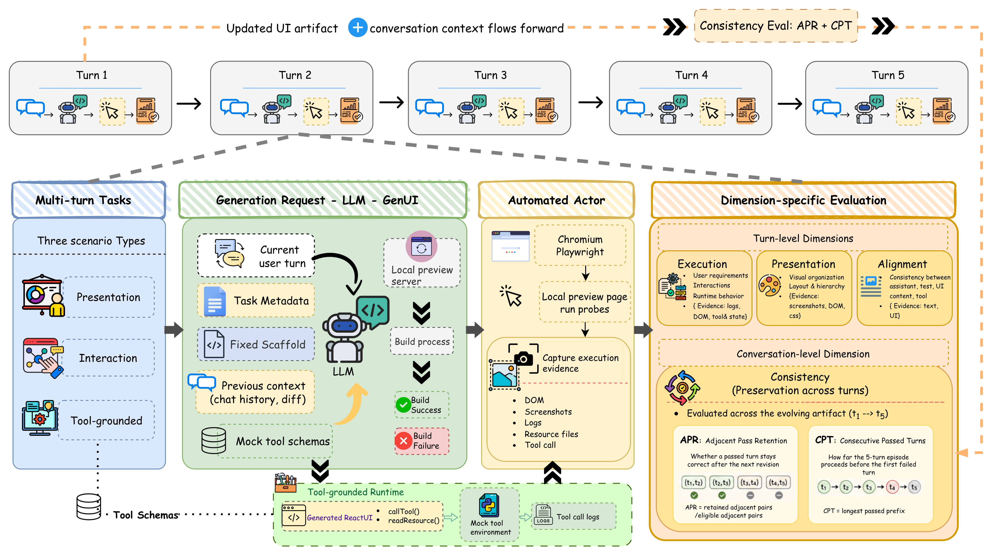

# EvoGenUI-Bench

<p align="center">
  <strong>Related Project</strong><br>
  <a href="https://github.com/pengyue-polaron/deepseek-harness-genui"><strong>DeepSeek Harness GenUI →</strong></a><br>
  <em>Build task-specific React interfaces for DeepSeek Harness, with state carried across agent turns.</em>
</p>

**EMNLP 2026**



## Abstract

Large language model can generate interactive web interfaces, but reliable generative UI requires maintaining an executable artifact as user requests evolve. We introduce EvoGenUI-Bench, a benchmark for multi-turn interface maintenance comprising 150 five-turn tasks and 750 turns across three scenarios: information presentation, executable interaction, and tool-grounded external state. We execute generated artifacts in a browser and evaluate them using screenshots, source and DOM evidence, actor traces, and runtime logs. Beyond turn-level and episode-level success, we measure cross-turn retention with Adjacent Pass Retention. Across eight models, even the strongest achieves 74.9% Turn Pass while completing only 37.3% of five-turn episodes; APR further falls to 52.4% on tool-grounded tasks. Diagnostic analysis shows that presentation failures center on information architecture, interaction failures on derived-state propagation and affordance binding, and tool-grounded failures additionally involve external-state grounding and requirement decomposition. These results reframe generative UI evaluation from judging isolated outputs to testing whether interface behavior, derived state, external state, and assistant claims remain synchronized as the artifact evolves.

## Quick Start

### Install

Requires Python 3.11+, `uv`, Node.js, and Corepack.

```bash
uv sync
corepack enable
corepack yarn install --immutable
uv run playwright install chromium
cp .env.example .env
```

### Configure

Set provider keys in `.env`, then edit [`configs/example.yaml`](configs/example.yaml).

| Field | Purpose |
| --- | --- |
| `experiment.id` | Names the run and its output directory under `experiments/`. |
| `dataset.tasks_path` | Points to a task JSON file or a directory of task JSON files. |
| `dataset.turns` | Selects `all` turns or an explicit list such as `[1, 2]`. |
| `models` | Defines the model or models being benchmarked. |
| `evaluator` | Configures the model used for dimension-specific scoring. |
| `blind_actor` | Configures the browser agent that interacts with generated interfaces. |
| `runtime.concurrency` | Sets worker counts for generation, execution, and evaluation. |

Each model component reads its provider credential from the environment variable named by `api_key_env`. Task sources should follow the [`multiturn_tasks` schema](bench/multiturn_tasks.schema.json).

### Run

Run the complete pipeline:

```bash
uv run evogenui-bench experiment --config configs/example.yaml
```

Run generation, execution, and evaluation separately:

```bash
uv run evogenui-bench experiment --config configs/example.yaml --stage generate
uv run evogenui-bench experiment --config configs/example.yaml --stage execute --resume
uv run evogenui-bench experiment --config configs/example.yaml --stage evaluate --resume
```

Run a single task:

```bash
uv run evogenui-bench experiment \
  --config configs/example.yaml \
  --task-id "Task Name"
```

Results are written to `experiments/<experiment.id>/`. To browse completed runs:

```bash
uv run evogenui-web
```

## Repository Structure

```text
runner/
├── generation/     Model prompting and artifact generation
├── execution/      Builds, browser interaction, and evidence capture
├── evaluation/     Dimension judges and reliability metrics
├── orchestration/  Experiment CLI and multi-turn stage coordination
└── tools/          Configuration, task loading, and reporting utilities
runtime/            Tool backends and shared runtime types
scaffold/           Vite + React workspace used to build generated UIs
web/                Results viewer, task and tool libraries, and playground
configs/            Experiment configuration
bench/              Multi-turn task schema
tests/              Protocol and pipeline tests
```
